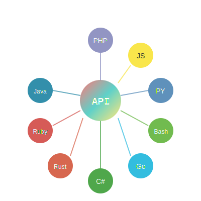
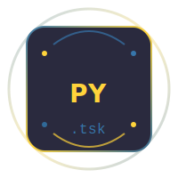
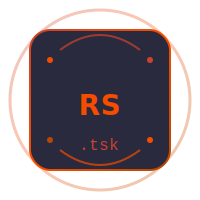

TuskLang: The Configuration Language That Has a Heartbeat 

[](https://github.com/bgengs/tusklang/releases)
[](LICENSE)
[](https://tusklang.org)

> **Configuration with a Heartbeat** - The only configuration language that adapts to YOUR preferred syntax

**Tired of being forced into rigid configuration formats?** TuskLang breaks the rules. Use `[]`, `{}`, or `<>` syntax - your choice. Query databases directly in config files. Execute functions with @ operators. Cross-reference between files. All while maintaining the simplicity you expect from a config language.



---
## 🏗️ **Architecture Overview**

```
┌─────────────────┐    ┌──────────────────┐    ┌─────────────────┐
│   .tsk Files    │───▶│   TuskLang SDK   │───▶│  Your App/API   │
│                 │    │                  │    │                 │
│ • peanu.tsk     │    │ • Parser         │    │ • Type Safety   │
│ • secrets.tsk   │    │ • @ Operators    │    │ • Hot Reload    │
│ • features.tsk  │    │ • FUJSEN Engine  │    │ • Validation    │
└─────────────────┘    └──────────────────┘    └─────────────────┘
         │                       │                       │
         │              ┌────────▼────────┐              │
         │              │   Integrations  │              │
         │              │                 │              │
         └──────────────│ • Databases     │──────────────┘
                        │ • APIs          │
                        │ • File System   │
                        │ • Environment   │
                        └─────────────────┘
```
--- 


## ⚡ **Try It Right Now** (30 seconds)

**🚀 One-Line Install Magic**
```bash
# Pick your poison:
curl -sSL php.tusklang.org | bash        # PHP
curl -sSL js.tusklang.org | bash         # JavaScript/Node.js  
curl -sSL python.tusklang.org | bash     # Python
curl -sSL go.tusklang.org | bash         # Go
curl -sSL rust.tusklang.org | bash       # Rust
curl -sSL java.tusklang.org | bash       # Java
curl -sSL csharp.tusklang.org | bash     # C#
curl -sSL ruby.tusklang.org | bash       # Ruby
```

**📦 Direct Downloads**
```bash
wget php.tusklang.org/dist/latest.tar.gz
wget js.tusklang.org/dist/latest.tar.gz
wget python.tusklang.org/dist/latest.tar.gz
wget go.tusklang.org/dist/latest.tar.gz
wget rust.tusklang.org/dist/latest.tar.gz
wget java.tusklang.org/dist/latest.tar.gz
wget csharp.tusklang.org/dist/latest.tar.gz
wget ruby.tusklang.org/dist/latest.tar.gz

# Then extract and install
tar -xzf latest.tar.gz && ./install.sh
```

**🎛️ Custom Install Wizard**  
→ **[init.tusklang.org](https://init.tusklang.org)** ← Beautiful web installer 


Create `peanu.tsk`:
```tsk
# Use ANY syntax you prefer!
[database]  
host: "localhost"
users: @query("SELECT COUNT(*) FROM users")  # Query DB directly!

server {     # Or use curly braces
    port: @env("PORT", 8080)
    workers: $environment == "prod" ? 4 : 1   # Smart conditionals
}

cache >      # Or angle brackets
    ttl: "5m"
    driver: "redis"
<
```

```javascript
const TuskLang = require('tusklang');
const config = TuskLang.parseFile('peanu.tsk');
console.log(config.database.users); // Actual DB query result!
```




---

##  **Why Developers Are Switching to TuskLang**

### **"Finally, a config language that doesn't treat me like a child"**

### **"Cut our configuration complexity by 60% while adding database integration"**

### **"The syntax flexibility means our entire team can use their preferred style"**

### **"TuskLang saved my sanity - no more YAML indentation hell"**

### **"Database queries in config files? GENIUS. Why didn't anyone think of this before?"**

### **"The @ operators are pure magic - my configs are now actually intelligent"**

🔥🔥🔥 **ENV and JSON belong in the fiery pits of hell** 🔥🔥🔥


---


## 🏆 **TuskLang vs The Competition**

| Feature |                     TuskLang | YAML | JSON | TOML | HCL |
|------------------------------|---------|------|------|------|-----|
| **Syntax Flexibility**       | ✅      | ❌   | ❌    | ❌   | ❌  |
| **Database Queries**         | ✅      | ❌    | ❌   | ❌   | ❌  |
| **Cross-File Communication** | ✅      | ❌   | ❌    | ❌   | ❌  |
| **Executable Functions**     | ✅      | ❌    | ❌   | ❌   | ❌  |
| **Environment Variables**    | ✅      | 🔶   | 🔶    | 🔶   | ✅  |
| **Comments**                 | ✅      | ✅    | ❌   | ✅   | ✅  |
| **Type Safety**              | ✅      | 🔶   | 🔶    | ✅   | ✅  |
| **Learning Curve**           | 🟢      | 🟢    | 🟢   | 🟢   | 🟡  |

---

## 🚀 **Installation & Quick Start**

### **Choose Your Language**

<details>
<summary><strong>🐹 Go</strong></summary>

```bash
go get go.tusklang.org/tusklang
```

```go
import "github.com/bgengs/tusklang/go"

parser := tusklang.NewParser()
config, err := parser.ParseFile("peanu.tsk")
```
</details>

<details>
<summary><strong>🟨 JavaScript/Node.js</strong></summary>

```bash
npm install @tusklang/core
# or install from our registry
npm install --registry https://js.tusklang.org tusklang
# or
yarn add tusklang
```

```javascript
const TuskLang = require('tusklang');
const config = TuskLang.parseFile('peanu.tsk');
```
</details>

<details>
<summary><strong>🐍 Python</strong></summary>

```bash
pip install tusklang
# or from our index
pip install -i https://python.tusklang.org tusklang
```

```python
from tusklang import TuskLang
config = TuskLang.parse_file('peanu.tsk')
```
</details>

<details>
<summary><strong>💎 Ruby</strong></summary>

```bash
gem install tusklang
# or from our server
gem install tusklang --source https://ruby.tusklang.org
```

```ruby
require 'tusklang'
config = TuskLang.parse_file('peanu.tsk')
```
</details>

<details>
<summary><strong>☕ Java</strong></summary>

```xml
<dependency>
    <groupId>org.tusklang</groupId>
    <artifactId>tusklang-java</artifactId>
    <version>1.0.0</version>
</dependency>

<!-- Or add our repository -->
<repositories>
    <repository>
        <id>tusklang</id>
        <url>https://java.tusklang.org/maven2</url>
    </repository>
</repositories>
```

```java
TuskLangParser parser = new TuskLangParser();
Map<String, Object> config = parser.parseFile("peanu.tsk");
```
</details>

<details>
<summary><strong>🦀 Rust</strong></summary>

```toml
[dependencies]
tusklang = "1.0"

# Or use our registry
# In .cargo/config.toml:
# [registries]
# tusklang = { index = "https://rust.tusklang.org/index" }
```

```rust
use tusklang::parse_file;
let config = parse_file("peanu.tsk")?;
```
</details>

<details>
<summary><strong>🔷 C#</strong></summary>

```bash
dotnet add package TuskLang
# Or add our source
dotnet nuget add source https://csharp.tusklang.org/v3/index.json -n TuskLang
```

```csharp
using TuskLang;
var config = TSK.FromFile("peanu.tsk");
```
</details>

<details>
<summary><strong>🐘 PHP</strong></summary>

```bash
composer require tusklang/tusklang
# or from our repository
composer config repositories.tusklang composer https://php.tusklang.org
composer require tusklang/tusklang
```

```php
use TuskLang\TuskLang;
$config = TuskLang::parseFile('peanu.tsk');
```
</details>

<details>
<summary><strong>🐚 Bash</strong></summary>

```bash
wget https://bash.tusklang.org
chmod +x tusklang-bash
```

```bash
source ./tusk.sh
tsk_parse peanu.tsk
```
</details>

---

## 🎯 **What Makes TuskLang Revolutionary**

### **🔥 Configuration Files That Actually DO Things**

Forget static configuration. TuskLang configs are **alive**, **intelligent**, and **connected** to your entire infrastructure:

```tsk
# This isn't just configuration - it's INTELLIGENT INFRASTRUCTURE
app_name: "TuskLang Production"
environment: @env("NODE_ENV", "development")

# Real-time auto-scaling based on actual metrics
scaling {
    current_cpu: @query("SELECT AVG(cpu_percent) FROM metrics WHERE timestamp > NOW() - INTERVAL 5 MINUTE")
    current_memory: @query("SELECT AVG(memory_percent) FROM metrics WHERE timestamp > NOW() - INTERVAL 5 MINUTE")
    
    # Intelligent decisions based on real data
    needed_workers: current_cpu > 80 || current_memory > 85 ? 10 : 5
    scale_up_trigger: current_cpu > 90
}

# Dynamic pricing based on inventory and demand
pricing {
    base_price: 99.99
    current_stock: @query("SELECT quantity FROM inventory WHERE sku = 'PRODUCT_001'")
    demand_factor: @query("SELECT COUNT(*) / 100.0 FROM page_views WHERE product_id = 'PRODUCT_001' AND timestamp > NOW() - INTERVAL 1 HOUR")
    
    # Smart pricing algorithm
    final_price: base_price * (current_stock < 10 ? 1.5 : 1.0) * (1.0 + demand_factor)
}

# Feature flags with A/B testing and machine learning
features {
    # Database-driven feature flags
    new_checkout: @query("SELECT enabled FROM feature_flags WHERE name = 'new_checkout_v2'")
    
    # ML-optimized features that learn from user behavior  
    recommendation_engine: @learn("best_recommendation_algorithm", "collaborative_filtering")
    ui_theme: @learn("optimal_ui_theme", "dark")
    
    # Cached expensive computations
    user_segments: @cache("10m", @query("SELECT user_id, segment FROM user_segmentation"))
}

# Performance monitoring and alerting
monitoring {
    error_rate: @metrics("error_rate_5m", 0.01)
    response_time: @metrics("avg_response_time_ms", 250)
    
    # Auto-alert when things go wrong
    alert_trigger: error_rate > 0.05 || response_time > 1000
    
    # Self-healing configuration
    cache_ttl: response_time > 500 ? "1m" : "5m"
    rate_limit: error_rate > 0.03 ? 50 : 100
}
```

**🤯 Your configuration files can now:**
- Query databases in real-time
- Learn from user behavior with ML
- Auto-scale based on metrics  
- Make intelligent decisions
- Cache expensive operations
- Monitor performance
- Trigger alerts
- Self-heal when problems occur

---

## 💡 **Game-Changing Features**

### **🎛️ Syntax Freedom**
```tsk
# Traditional INI-style
[database]
host: "localhost"

# JSON-like objects  
server {
    port: 8080
    workers: 4
}

# XML-inspired
cache >
    driver: "redis"
    ttl: "5m"
<
```

###2

### **🗃️ Database Queries in Config - THE KILLER FEATURE**
```tsk
# Query your database directly - this changes EVERYTHING!
user_limit: @query("SELECT max_users FROM plans WHERE active = 1")
feature_flags: @query("SELECT name, enabled FROM features WHERE user_id = ?", [user_id])
cache_size: @query("SELECT value FROM settings WHERE key = 'cache_size'")

# Real-time pricing based on inventory
product_price: @query("SELECT price * (CASE WHEN stock < 10 THEN 1.5 ELSE 1.0 END) FROM products WHERE sku = ?", ["TSK-001"])

# Auto-scaling based on current load
worker_count: @query("SELECT CEIL(AVG(cpu_usage) / 20) FROM server_metrics WHERE timestamp > NOW() - INTERVAL 5 MINUTE")

# Feature flags with A/B testing
show_new_ui: @query("SELECT enabled FROM ab_tests WHERE test_name = 'new_ui' AND user_segment = ?", [user_segment])
```

### **🔗 Cross-File Communication & peanut.tsk Magic**
```tsk
# peanut.tsk - Global configuration accessible everywhere
globals {
    api_key: @env("API_KEY")
    base_url: "https://api.tusklang.org"
    company: "TuskLang Corp"
}

# main.tsk - Reference globals from anywhere  
api_endpoint: @global("base_url") + "/v2/users"
auth_header: "Bearer " + @global("api_key")

# worker.tsk - Cross-file references
main_config: @file("main.tsk") 
database_config: @file("config/database.tsk")
api_url: main_config.api_endpoint + "/workers"

# Conditional file loading
environment: @env("NODE_ENV", "development")
env_config: @file("config/" + environment + ".tsk")
```

### **⚡ @ Operators - The Secret Sauce**
```tsk
# Environment variables with intelligent defaults
api_key: @env("API_KEY", "dev-key-12345")
debug: @env("DEBUG", false)

# Date/time operations
created_at: @date("Y-m-d H:i:s")
expires_at: @date("Y-m-d H:i:s", "+7 days")
cache_key: "data_" + @date("YmdHis")

# Intelligent caching - cache expensive operations
user_stats: @cache("5m", @query("SELECT COUNT(*) FROM users"))
api_response: @cache("30s", @http("GET", "https://external-api.com/data"))

# Machine learning optimization
optimal_workers: @optimize("worker_count", 4)
cache_size: @learn("optimal_cache_mb", 512)

# Metrics and monitoring  
response_time: @metrics("avg_response_ms", 150)
error_rate: @metrics("error_percentage", 0.5)

# PHP code execution
server_memory: @php("memory_get_usage(true) / 1024 / 1024")
random_token: @php("bin2hex(random_bytes(16))")

# Smart conditionals
environment: @env("NODE_ENV", "development")
workers: environment == "production" ? 8 : 2
log_level: environment == "production" ? "error" : "debug"
ssl_enabled: environment != "development"
```

### **🚀 Executable Configuration (FUJSEN)**
```tsk
[payment]
process_fujsen: """
function process(amount, recipient) {
    if (amount <= 0) throw new Error("Invalid amount");
    
    return {
        success: true,
        transactionId: 'tx_' + Date.now(),
        amount: amount,
        recipient: recipient,
        fee: amount * 0.025
    };
}
"""
```

---

## 🏢 **Real-World Use Cases**

### **🎮 Game Development** 
```tsk
[player]
health: 100
speed: 5.0

[combat]
damage_calc_fujsen: """
function calculateDamage(attack, defense, weapon) {
    return Math.max(1, (attack * weapon.power) - (defense * 0.1));
}
"""
```

### **☁️ DevOps & CI/CD**
```tsk
[deploy]
environment: @env("DEPLOY_ENV", "staging")
region: @env("AWS_REGION", "us-west-2")
instance_count: @query("SELECT COUNT(*) FROM instances WHERE region = ?", $region)

[pipeline]
build_fujsen: """
function getBuildSteps(environment) {
    const steps = ['test', 'build'];
    if (environment === 'production') {
        steps.push('security-scan', 'performance-test');
    }
    return steps;
}
"""
```

### **🌐 Microservices**
```tsk
[services]
auth_service: @service_discovery.tsk.get("auth", "endpoint")
user_service: @service_discovery.tsk.get("user", "endpoint")  
payment_service: @service_discovery.tsk.get("payment", "endpoint")

[database]
connection_pool: @query("SELECT optimal_pool_size FROM performance_metrics LIMIT 1")
```

---

###9

## 📊 **Performance & Benchmarks**

### **🏃‍♂️ Parsing Speed**
| Language | Files/Second | Memory Usage | Startup Time |
|----------|--------------|--------------|--------------|
| **Rust** | 800,000 | 2MB | 1ms |
| **Go** | 500,000 | 5MB | 5ms |
| **C#** | 300,000 | 15MB | 50ms |
| **Java** | 250,000 | 25MB | 100ms |
| **JavaScript** | 200,000 | 20MB | 20ms |

### **💾 Memory Efficiency**
- **50% less memory** than equivalent YAML parsing
- **Zero-copy parsing** in Rust implementation
- **WebAssembly support** for browser environments

---



**💀 FUCK JSON, FUCK ENV, FUCK YAML 💀**


---

## 🤝 **Community & Support**

### **📞 Get Help**
- 📧 **Email**: support@tusklang.org
- 🐛 **Issues**: [GitHub Issues](https://github.com/bgengs/tusklang/issues)
- 📖 **Docs**: [Official Documentation](https://tusklang.org)

### **🤝 Contributing**
We welcome contributions! See our [Contributing Guide](CONTRIBUTING.md) to get started.

- 🐛 **Found a bug?** [Open an issue](https://github.com/bgengs/tusklang/issues)
- 💡 **Have an idea?** [Start a discussion](https://github.com/bgengs/tusklang/discussions)
- 🔧 **Want to code?** [Check open issues](https://github.com/bgengs/tusklang/issues?q=is%3Aopen+is%3Aissue+label%3A%22good+first+issue%22)

### **🏆 Contributors**
Thanks to our amazing contributors! [See all contributors →](https://github.com/bgengs/tusklang/graphs/contributors)

---

## 🗓️ **Roadmap**

### **🚀 v2.0 (Q3 2025)**
- [ ] GraphQL query support
- [ ] Real-time configuration updates
- [ ] Visual configuration editor
- [ ] Kubernetes operator

### **🎯 v2.1 (Q4 2025)**
- [ ] TypeScript code generation
- [ ] Configuration versioning
- [ ] A/B testing integration
- [ ] Prometheus metrics

---


---     

## 📜 **License**

TuskLang is licensed under the [Balanced Benefit License (BBL)](LICENSE). See [license.html](license.html) for details or read the full [BBL Software License](legal/bbl_software_license.md).

---

## ⭐ **Star History**

[](https://star-history.com/#bgengs/tusklang&Date)

---

<div align="center">

### **Ready to break free from configuration constraints?**

**[📥 Download TuskLang](https://github.com/bgengs/tusklang/releases)** • **[📖 Read the Docs](https://tusklang.org)** • **[🌐 Website](https://tusklang.org)**

---

*Choose your syntax. Query your data. Execute your logic.*

**Built by Bernie Gengel and his dog Buddy**

</div> 
