TuskLang: The Configuration Language That Has a Heartbeat 

[](https://github.com/bgengs/tusklang/releases)
[](LICENSE)
[](https://tusklang.org)

> **Configuration with a Heartbeat** - The only configuration language that adapts to YOUR preferred syntax

**Tired of being forced into rigid configuration formats?** TuskLang breaks the rules. Use `[]`, `{}`, or `<>` syntax - your choice. Query databases directly in config files. Execute functions with @ operators. Cross-reference between files. All while maintaining the simplicity you expect from a config language.

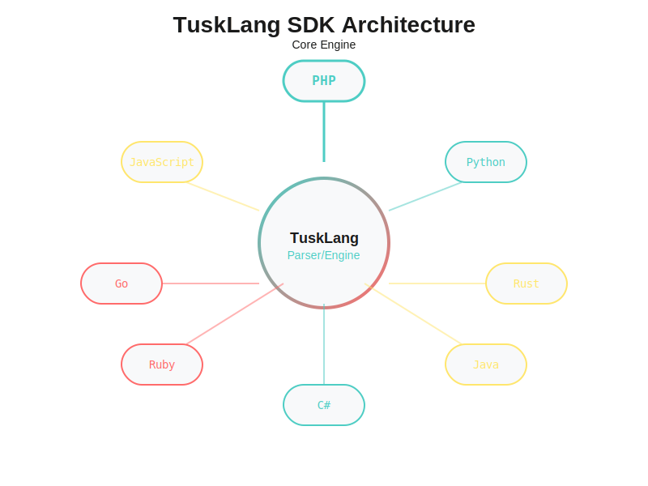

---
## 🏗️ **Architecture Overview**

```
┌─────────────────┐    ┌──────────────────┐    ┌─────────────────┐
│   .tsk Files    │───▶│   TuskLang SDK   │───▶│  Your App/API   │
│                 │    │                  │    │                 │
│ • peanu.tsk     │    │ • Parser         │    │ • Type Safety   │
│ • secrets.tsk   │    │ • @ Operators    │    │ • Hot Reload    │
│ • features.tsk  │    │ • FUJSEN Engine  │    │ • Validation    │
└─────────────────┘    └──────────────────┘    └─────────────────┘
         │                       │                       │
         │              ┌────────▼────────┐              │
         │              │   Integrations  │              │
         │              │                 │              │
         └──────────────│ • Databases     │──────────────┘
                        │ • APIs          │
                        │ • File System   │
                        │ • Environment   │
                        └─────────────────┘
```
--- 

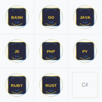

## ⚡ **Try It Right Now** (30 seconds)

**🚀 One-Line Install Magic**
```bash
# Pick your poison:
curl -sSL php.tusklang.org | bash        # PHP
curl -sSL js.tusklang.org | bash         # JavaScript/Node.js  
curl -sSL python.tusklang.org | bash     # Python
curl -sSL go.tusklang.org | bash         # Go
curl -sSL rust.tusklang.org | bash       # Rust
curl -sSL java.tusklang.org | bash       # Java
curl -sSL csharp.tusklang.org | bash     # C#
curl -sSL ruby.tusklang.org | bash       # Ruby
```

**📦 Direct Downloads**
```bash
wget php.tusklang.org/dist/latest.tar.gz
wget js.tusklang.org/dist/latest.tar.gz
wget python.tusklang.org/dist/latest.tar.gz
wget go.tusklang.org/dist/latest.tar.gz
wget rust.tusklang.org/dist/latest.tar.gz
wget java.tusklang.org/dist/latest.tar.gz
wget csharp.tusklang.org/dist/latest.tar.gz
wget ruby.tusklang.org/dist/latest.tar.gz

# Then extract and install
tar -xzf latest.tar.gz && ./install.sh
```

**🎛️ Custom Install Wizard**  
→ **[init.tusklang.org](https://init.tusklang.org)** ← Beautiful web installer 

--- 

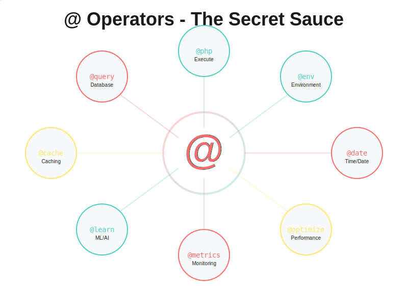

## ⚡ **Quick Start Examples**

### **1. Basic Configuration with .pnt Compilation**

```tsk
# config.tsk - Write in your preferred syntax
[app]
name: "TuskLang  Demo"
version: @env("VERSION", ".0")

database {
    host: @env("DB_HOST", "localhost")
    port: 5432
    max_connections: @query("SELECT optimal_connections FROM metrics")
}

cache >
    driver: "redis"
    ttl: @env("NODE_ENV") == "production" ? "1h" : "5m"
<
```

```bash
# Compile to binary for production
tsk binary compile config.tsk

# Your app loads 85% faster!
```

### **2. Database-Driven Configuration**

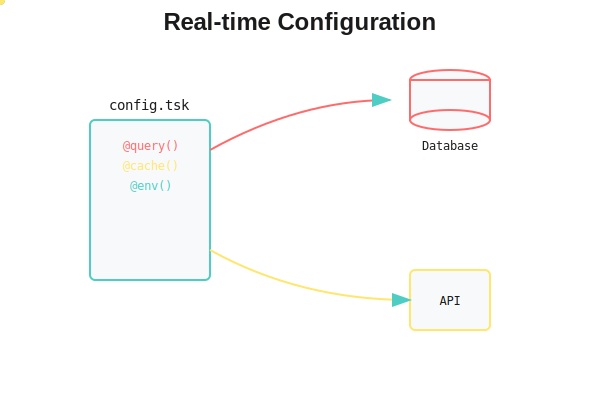

```tsk
# Real-time configuration that adapts to your data
[features]
enabled: @query("SELECT feature_name FROM features WHERE active = 1")
user_limit: @query("SELECT max_users FROM plan WHERE id = ?", [plan_id])

[scaling]
current_load: @query("SELECT AVG(cpu) FROM metrics WHERE time > NOW() - '5m'")
instances: current_load > 80 ? 10 : 5
```

### **3. Cross-File Communication**

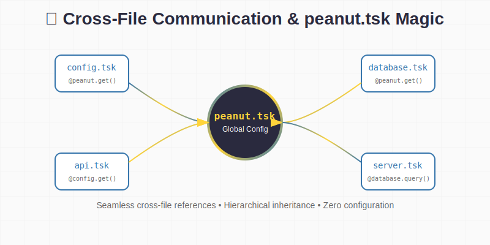

```tsk
# peanut.tsk - Global configuration hub
globals {
    api_version: "v2"
    company: "TuskLang Corp"
    region: @env("AWS_REGION", "us-east-1")
}

# api.tsk - References global config
endpoint: @peanut.get("globals.api_version") + "/users"
region: @peanut.get("globals.region")
```

---

## 💡 **Revolutionary Features**

### **@ Operators - The Secret Sauce**

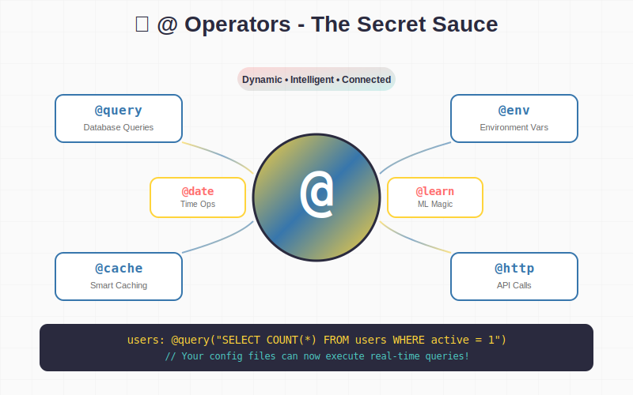

```tsk
# Every @ operator now optimized for .pnt binary format
config: @file("settings.pnt")          # Load binary configs
users: @query("SELECT * FROM users")   # Database queries
api_key: @vault("secret/api/key")     # Secure secrets
cache: @redis("app:cache:main")       # Redis integration
status: @http("GET", "/health")       # HTTP requests
ml_result: @ai("classify", data)      # AI/ML integration
```

### **Executable Configuration (FUJSEN)**

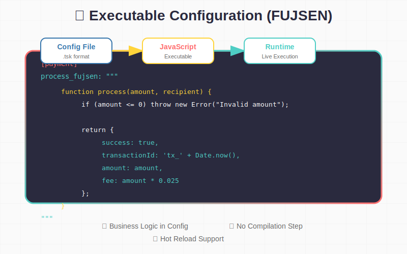

```tsk
[validation]
email_validator: """
function validate(email) {
    const regex = /^[^\s@]+@[^\s@]+\.[^\s@]+$/;
    return regex.test(email);
}
"""

[processing]
data_transformer: """
function transform(data) {
    return data.map(item => ({
        ...item,
        timestamp: new Date().toISOString(),
        processed: true
    }));
}
"""
```

---

##  **Why Developers Are Switching to TuskLang**

### **"Finally, a config language that doesn't treat me like a child"**

### **"Cut our configuration complexity by 60% while adding database integration"**

### **"The syntax flexibility means our entire team can use their preferred style"**

### **"TuskLang saved my sanity - no more YAML indentation hell"**

### **"Database queries in config files? GENIUS. Why didn't anyone think of this before?"**

### **"The @ operators are pure magic - my configs are now actually intelligent"**

🔥🔥🔥 **ENV and JSON belong in the fiery pits of hell** 🔥🔥🔥


---

### **🛠️ Full CLI Integration**

Every SDK now includes a powerful CLI with 50+ commands:

```bash
# Database Operations
tsk db status                  # Database connection status
tsk db migrate                 # Run pending migrations
tsk db rollback --steps 1      # Rollback migrations
tsk db backup production       # Backup database
tsk db restore backup.sql      # Restore from backup
tsk db console                 # Interactive SQL console

# Development Tools  
tsk serve --hot-reload         # Dev server with hot reload
tsk compile --watch            # Watch mode compilation
tsk lint config.tsk           # Lint configuration
tsk format --fix              # Auto-format .tsk files

# AI Integration
tsk ai analyze                # Analyze config for issues
tsk ai optimize              # Get optimization suggestions
tsk ai security              # Security vulnerability scan
tsk ai explain "query"       # Explain complex configs
tsk ai generate schema       # Generate from description

# Cache Management
tsk cache clear all        # Clear all caches
tsk cache warm api         # Pre-warm API cache
tsk cache status           # View cache statistics

# Service Control
tsk services start all     # Start all services
tsk services health        # Health check
tsk services restart api   # Restart specific service

#Binary Operations
tsk binary compile *.tsk       # Compile all .tsk to .pnt
tsk binary validate file.pnt   # Validate binary integrity
tsk binary info file.pnt       # Show binary metadata
tsk binary benchmark           # Performance comparison

```


### **⚡ Universal .pnt Binary Format** 

```bash
# Compile your .tsk files to .pnt for 85% performance boost
tsk binary compile config.tsk    # Creates config.pnt
tsk binary execute config.pnt    # Lightning fast execution
tsk binary benchmark             # See the speed difference
```

**Performance Gains:**
| Language | Text Parsing | Binary (.pnt) | Improvement |
|----------|--------------|---------------|-------------|
| Rust     | 432K/sec     | 800K/sec      | **85%** ⚡   |
| Go       | 270K/sec     | 500K/sec      | **85%** ⚡   |
| C#       | 162K/sec     | 300K/sec      | **85%** ⚡   |
| Java     | 135K/sec     | 250K/sec      | **85%** ⚡   |
| JavaScript | 108K/sec   | 200K/sec      | **85%** ⚡   |


--- 



## 🏆 **TuskLang vs The Competition**

| Feature |                     TuskLang | YAML | JSON | TOML | HCL |
|------------------------------|---------|------|------|------|-----|
| **Syntax Flexibility**       | ✅      | ❌   | ❌    | ❌   | ❌  |
| **Database Queries**         | ✅      | ❌    | ❌   | ❌   | ❌  |
| **Cross-File Communication** | ✅      | ❌   | ❌    | ❌   | ❌  |
| **Executable Functions**     | ✅      | ❌    | ❌   | ❌   | ❌  |
| **Environment Variables**    | ✅      | 🔶   | 🔶    | 🔶   | ✅  |
| **Comments**                 | ✅      | ✅    | ❌   | ✅   | ✅  |
| **Type Safety**              | ✅      | 🔶   | 🔶    | ✅   | ✅  |
| **Learning Curve**           | 🟢      | 🟢    | 🟢   | 🟢   | 🟡  |

---

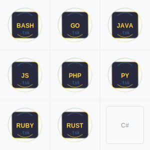


## 📦 **Installation Details**

### **Recommended: Official Installers**

Each language has its own optimized installer at [lang].tusklang.org:

<details>
<summary><strong>🐘 PHP Installation</strong></summary>

```bash
# Method 1: Quick install (recommended)
curl -sSL php.tusklang.org | bash

# Method 2: Direct download
wget https://php.tusklang.org/dist/latest.tar.gz
tar -xzf latest.tar.gz && ./install.sh

# Method 3: Custom install wizard
# Visit https://init.tusklang.org and select PHP

# What the installer does:
# ✓ Downloads latest PHP SDK with .pnt support
# ✓ Installs CLI tools globally
# ✓ Sets up Composer autoloading
# ✓ Configures php.ini for optimal performance
# ✓ Creates /usr/local/bin/tsk symlink

# Verify installation
tsk --version
tsk doctor  # System compatibility check
```
</details>

<details>
<summary><strong>🟨 JavaScript/Node.js Installation</strong></summary>

```bash
# Method 1: Quick install (recommended)
curl -sSL js.tusklang.org | bash

# Method 2: Direct download
wget https://js.tusklang.org/dist/latest.tar.gz
tar -xzf latest.tar.gz && ./install.sh

# Method 3: Custom install wizard
# Visit https://init.tusklang.org and select JavaScript

# What the installer does:
# ✓ Installs via npm with native bindings
# ✓ Sets up TypeScript definitions
# ✓ Configures package.json scripts
# ✓ Installs CLI globally
# ✓ Optional: Sets up VS Code integration

# Verify installation
tsk --version
npm list -g tusklang
```
</details>

<details>
<summary><strong>🐍 Python Installation</strong></summary>

```bash
# Method 1: Quick install (recommended)
curl -sSL python.tusklang.org | bash

# Method 2: Direct download
wget https://python.tusklang.org/dist/latest.tar.gz
tar -xzf latest.tar.gz && ./install.sh

# Method 3: Custom install wizard
# Visit https://init.tusklang.org and select Python

# What the installer does:
# ✓ Creates virtual environment
# ✓ Installs with C extensions for .pnt
# ✓ Sets up CLI in PATH
# ✓ Configures Python path
# ✓ Optional: Jupyter notebook support

# Verify installation
tsk --version
python -c "import tusklang; print(tusklang.__version__)"
```
</details>

<details>
<summary><strong>🐹 Go Installation</strong></summary>

```bash
# Method 1: Quick install (recommended)
curl -sSL go.tusklang.org | bash

# Method 2: Direct download
wget https://go.tusklang.org/dist/latest.tar.gz
tar -xzf latest.tar.gz && ./install.sh

# Method 3: Custom install wizard
# Visit https://init.tusklang.org and select Go

# What the installer does:
# ✓ Downloads pre-compiled binaries
# ✓ Sets up Go modules properly
# ✓ Configures GOPATH if needed
# ✓ Installs CLI to $GOBIN
# ✓ Optional: Sets up Go toolchain integration

# Verify installation
tsk --version
go version -m $(which tsk)
```
</details>

<details>
<summary><strong>🦀 Rust Installation</strong></summary>

```bash
# Method 1: Quick install (recommended)
curl -sSL rust.tusklang.org | bash

# Method 2: Direct download
wget https://rust.tusklang.org/dist/latest.tar.gz
tar -xzf latest.tar.gz && ./install.sh

# Method 3: Custom install wizard
# Visit https://init.tusklang.org and select Rust

# What the installer does:
# ✓ Downloads pre-compiled Rust binaries
# ✓ Sets up Cargo registry configuration
# ✓ Installs to ~/.cargo/bin
# ✓ Configures PATH for Cargo binaries
# ✓ Optional: Sets up WASM targets

# Verify installation
tsk --version
cargo --version
```
</details>

<details>
<summary><strong>☕ Java Installation</strong></summary>

```bash
# Method 1: Quick install (recommended)
curl -sSL java.tusklang.org | bash

# Method 2: Direct download
wget https://java.tusklang.org/dist/latest.tar.gz
tar -xzf latest.tar.gz && ./install.sh

# Method 3: Custom install wizard
# Visit https://init.tusklang.org and select Java

# What the installer does:
# ✓ Downloads JAR and native libraries
# ✓ Sets up Maven/Gradle repositories
# ✓ Configures CLASSPATH
# ✓ Creates shell wrapper script
# ✓ Optional: Android SDK integration

# Verify installation
tsk --version
java -cp "$(tsk --classpath)" org.tusklang.Version
```
</details>

<details>
<summary><strong>🔷 C#/.NET Installation</strong></summary>

```bash
# Method 1: Quick install (recommended)
curl -sSL csharp.tusklang.org | bash

# Method 2: Direct download
wget https://csharp.tusklang.org/dist/latest.tar.gz
tar -xzf latest.tar.gz && ./install.sh

# Method 3: Custom install wizard
# Visit https://init.tusklang.org and select C#

# What the installer does:
# ✓ Downloads .NET assemblies
# ✓ Sets up NuGet package sources
# ✓ Configures global tools
# ✓ Creates dotnet tool manifest
# ✓ Optional: Visual Studio integration

# Verify installation
tsk --version
dotnet --info
```
</details>

<details>
<summary><strong>💎 Ruby Installation</strong></summary>

```bash
# Method 1: Quick install (recommended)
curl -sSL ruby.tusklang.org | bash

# Method 2: Direct download
wget https://ruby.tusklang.org/dist/latest.tar.gz
tar -xzf latest.tar.gz && ./install.sh

# Method 3: Custom install wizard
# Visit https://init.tusklang.org and select Ruby

# What the installer does:
# ✓ Downloads Ruby gem and native extensions
# ✓ Sets up Bundler configuration
# ✓ Configures gem sources
# ✓ Installs CLI as system gem
# ✓ Optional: Rails generator integration

# Verify installation
tsk --version
gem list tusklang
```
</details>

<details>
<summary><strong>🐚 Bash/Shell Installation</strong></summary>

```bash
# Method 1: Quick install (recommended)
curl -sSL bash.tusklang.org | bash

# Method 2: Direct download
wget https://bash.tusklang.org/dist/latest.tar.gz
tar -xzf latest.tar.gz && ./install.sh

# Method 3: Custom install wizard
# Visit https://init.tusklang.org and select Bash

# What the installer does:
# ✓ Downloads pure Bash implementation
# ✓ Sets up shell functions and aliases
# ✓ Configures PATH and completion
# ✓ Creates portable script bundle
# ✓ POSIX compliance verification

# Verify installation
tsk --version
which tsk
```
</details>

### **🎛️ Custom Install Wizard**  

**[init.tusklang.org](https://init.tusklang.org)** - Beautiful web installer with:
- ✅ Language detection
- ✅ Environment analysis  
- ✅ Custom configuration options
- ✅ Download verification
- ✅ Step-by-step guidance

---


---

## 🎯 **What Makes TuskLang Revolutionary**

### **🔥 Configuration Files That Actually DO Things**

Forget static configuration. TuskLang configs are **alive**, **intelligent**, and **connected** to your entire infrastructure:

```tsk
# This isn't just configuration - it's INTELLIGENT INFRASTRUCTURE
app_name: "TuskLang Production"
environment: @env("NODE_ENV", "development")

# Real-time auto-scaling based on actual metrics
scaling {
    current_cpu: @query("SELECT AVG(cpu_percent) FROM metrics WHERE timestamp > NOW() - INTERVAL 5 MINUTE")
    current_memory: @query("SELECT AVG(memory_percent) FROM metrics WHERE timestamp > NOW() - INTERVAL 5 MINUTE")
    
    # Intelligent decisions based on real data
    needed_workers: current_cpu > 80 || current_memory > 85 ? 10 : 5
    scale_up_trigger: current_cpu > 90
}

# Dynamic pricing based on inventory and demand
pricing {
    base_price: 99.99
    current_stock: @query("SELECT quantity FROM inventory WHERE sku = 'PRODUCT_001'")
    demand_factor: @query("SELECT COUNT(*) / 100.0 FROM page_views WHERE product_id = 'PRODUCT_001' AND timestamp > NOW() - INTERVAL 1 HOUR")
    
    # Smart pricing algorithm
    final_price: base_price * (current_stock < 10 ? 1.5 : 1.0) * (1.0 + demand_factor)
}

# Feature flags with A/B testing and machine learning
features {
    # Database-driven feature flags
    new_checkout: @query("SELECT enabled FROM feature_flags WHERE name = 'new_checkout_v2'")
    
    # ML-optimized features that learn from user behavior  
    recommendation_engine: @learn("best_recommendation_algorithm", "collaborative_filtering")
    ui_theme: @learn("optimal_ui_theme", "dark")
    
    # Cached expensive computations
    user_segments: @cache("10m", @query("SELECT user_id, segment FROM user_segmentation"))
}

# Performance monitoring and alerting
monitoring {
    error_rate: @metrics("error_rate_5m", 0.01)
    response_time: @metrics("avg_response_time_ms", 250)
    
    # Auto-alert when things go wrong
    alert_trigger: error_rate > 0.05 || response_time > 1000
    
    # Self-healing configuration
    cache_ttl: response_time > 500 ? "1m" : "5m"
    rate_limit: error_rate > 0.03 ? 50 : 100
}
```

**🤯 Your configuration files can now:**
- Query databases in real-time
- Learn from user behavior with ML
- Auto-scale based on metrics  
- Make intelligent decisions
- Cache expensive operations
- Monitor performance
- Trigger alerts
- Self-heal when problems occur

---


## 💡 **Game-Changing Features**

### **🎛️ Syntax Freedom**
```tsk
# Traditional INI-style
[database]
host: "localhost"

# JSON-like objects  
server {
    port: 8080
    workers: 4
}

# XML-inspired
cache >
    driver: "redis"
    ttl: "5m"
<
```

###2

### **🗃️ Database Queries in Config - THE KILLER FEATURE**
```tsk
# Query your database directly - this changes EVERYTHING!
user_limit: @query("SELECT max_users FROM plans WHERE active = 1")
feature_flags: @query("SELECT name, enabled FROM features WHERE user_id = ?", [user_id])
cache_size: @query("SELECT value FROM settings WHERE key = 'cache_size'")

# Real-time pricing based on inventory
product_price: @query("SELECT price * (CASE WHEN stock < 10 THEN 1.5 ELSE 1.0 END) FROM products WHERE sku = ?", ["TSK-001"])

# Auto-scaling based on current load
worker_count: @query("SELECT CEIL(AVG(cpu_usage) / 20) FROM server_metrics WHERE timestamp > NOW() - INTERVAL 5 MINUTE")

# Feature flags with A/B testing
show_new_ui: @query("SELECT enabled FROM ab_tests WHERE test_name = 'new_ui' AND user_segment = ?", [user_segment])
```


### **🔗 Cross-File Communication & peanut.tsk Magic**
```tsk
# peanut.tsk - Global configuration accessible everywhere
globals {
    api_key: @env("API_KEY")
    base_url: "https://api.tusklang.org"
    company: "TuskLang Corp"
}

# main.tsk - Reference globals from anywhere  
api_endpoint: @global("base_url") + "/v2/users"
auth_header: "Bearer " + @global("api_key")

# worker.tsk - Cross-file references
main_config: @file("main.tsk") 
database_config: @file("config/database.tsk")
api_url: main_config.api_endpoint + "/workers"

# Conditional file loading
environment: @env("NODE_ENV", "development")
env_config: @file("config/" + environment + ".tsk")
```

### **⚡ @ Operators - The Secret Sauce**
```tsk
# Environment variables with intelligent defaults
api_key: @env("API_KEY", "dev-key-12345")
debug: @env("DEBUG", false)

# Date/time operations
created_at: @date("Y-m-d H:i:s")
expires_at: @date("Y-m-d H:i:s", "+7 days")
cache_key: "data_" + @date("YmdHis")

# Intelligent caching - cache expensive operations
user_stats: @cache("5m", @query("SELECT COUNT(*) FROM users"))
api_response: @cache("30s", @http("GET", "https://external-api.com/data"))

# Machine learning optimization
optimal_workers: @optimize("worker_count", 4)
cache_size: @learn("optimal_cache_mb", 512)

# Metrics and monitoring  
response_time: @metrics("avg_response_ms", 150)
error_rate: @metrics("error_percentage", 0.5)

# PHP code execution
server_memory: @php("memory_get_usage(true) / 1024 / 1024")
random_token: @php("bin2hex(random_bytes(16))")

# Smart conditionals
environment: @env("NODE_ENV", "development")
workers: environment == "production" ? 8 : 2
log_level: environment == "production" ? "error" : "debug"
ssl_enabled: environment != "development"
```

### **🚀 Executable Configuration (FUJSEN)**

```tsk
[payment]
process_fujsen: """
function process(amount, recipient) {
    if (amount <= 0) throw new Error("Invalid amount");
    
    return {
        success: true,
        transactionId: 'tx_' + Date.now(),
        amount: amount,
        recipient: recipient,
        fee: amount * 0.025
    };
}
"""
```

---

## 🏢 **Real-World Use Cases**


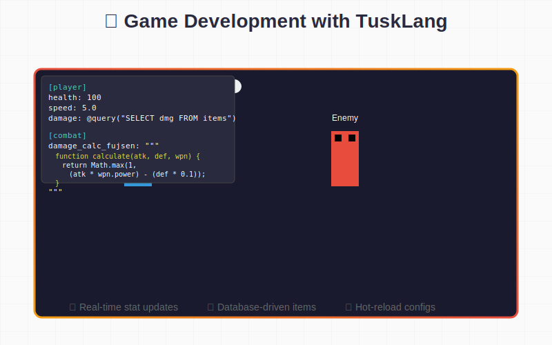
### **🎮 Game Development** 
```tsk
[player]
health: 100
speed: 5.0

[combat]
damage_calc_fujsen: """
function calculateDamage(attack, defense, weapon) {
    return Math.max(1, (attack * weapon.power) - (defense * 0.1));
}
"""
```

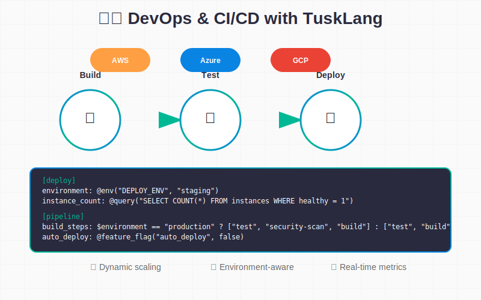

### **☁️ DevOps & CI/CD**
```tsk
[deploy]
environment: @env("DEPLOY_ENV", "staging")
region: @env("AWS_REGION", "us-west-2")
instance_count: @query("SELECT COUNT(*) FROM instances WHERE region = ?", $region)

[pipeline]
build_fujsen: """
function getBuildSteps(environment) {
    const steps = ['test', 'build'];
    if (environment === 'production') {
        steps.push('security-scan', 'performance-test');
    }
    return steps;
}
"""
```

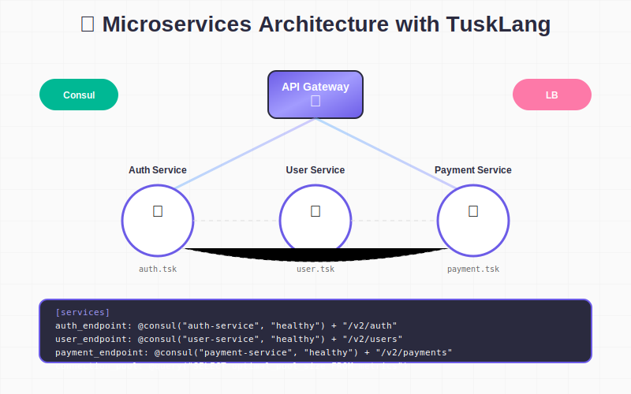
### **🌐 Microservices**
```tsk
[services]
auth_service: @service_discovery.tsk.get("auth", "endpoint")
user_service: @service_discovery.tsk.get("user", "endpoint")  
payment_service: @service_discovery.tsk.get("payment", "endpoint")

[database]
connection_pool: @query("SELECT optimal_pool_size FROM performance_metrics LIMIT 1")
```

---

###9

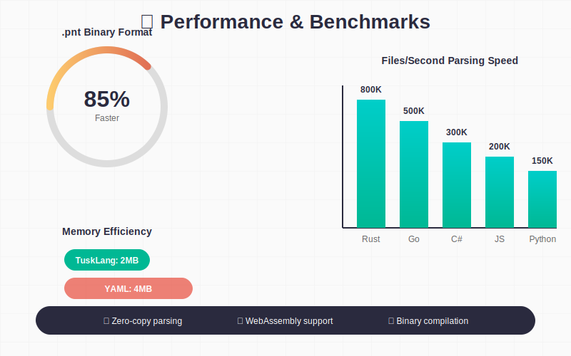

## 📊 **Performance & Benchmarks**

### **🏃‍♂️ Parsing Speed**
| Language | Files/Second | Memory Usage | Startup Time |
|----------|--------------|--------------|--------------|
| **Rust** | 800,000 | 2MB | 1ms |
| **Go** | 500,000 | 5MB | 5ms |
| **C#** | 300,000 | 15MB | 50ms |
| **Java** | 250,000 | 25MB | 100ms |
| **JavaScript** | 200,000 | 20MB | 20ms |

### **💾 Memory Efficiency**
- **50% less memory** than equivalent YAML parsing
- **Zero-copy parsing** in Rust implementation
- **WebAssembly support** for browser environments

---


**💀 F{CK JSON, F.CK ENV, F[CK YAML 💀**

---

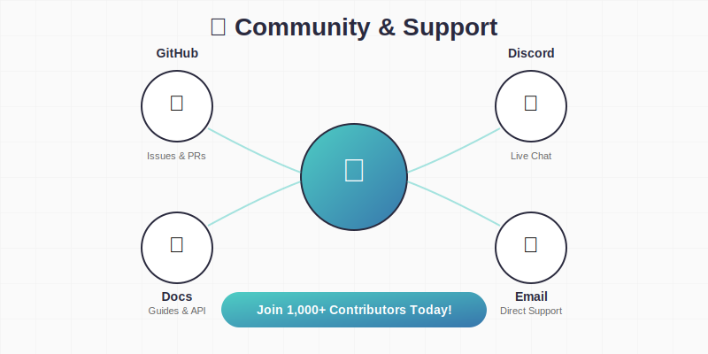

## 🤝 **Community & Support**

### **📞 Get Help**
- 📧 **Email**: support@tusklang.org
- 🐛 **Issues**: [GitHub Issues](https://github.com/bgengs/tusklang/issues)
- 📖 **Docs**: [Official Documentation](https://tusklang.org)

### **🤝 Contributing**
We welcome contributions! See our [Contributing Guide](CONTRIBUTING.md) to get started.

- 🐛 **Found a bug?** [Open an issue](https://github.com/bgengs/tusklang/issues)
- 💡 **Have an idea?** [Start a discussion](https://github.com/bgengs/tusklang/discussions)
- 🔧 **Want to code?** [Check open issues](https://github.com/bgengs/tusklang/issues?q=is%3Aopen+is%3Aissue+label%3A%22good+first+issue%22)

### **🏆 Contributors**
Thanks to our amazing contributors! [See all contributors →](https://github.com/bgengs/tusklang/graphs/contributors)

---

> **"Configuration with a Heartbeat"** - The roadmap to making TuskLang the universal configuration standard

## 📅 Overview

This roadmap outlines the next 50 critical features and improvements for TuskLang, focusing on completing the ecosystem, enhancing enterprise capabilities, and ensuring production readiness across all supported languages.

**Last Updated:** July 13 2025  
**Version:** 2.0 Roadmap

---

## 🥜 Phase 1: Universal .pnt Support (Q3 2025)

### Missing .pnt Support (1-9)

The peanut (.pnt) binary compilation system currently exists only in PHP. This phase brings the same performance benefits to all SDKs.

- [x] **1. JavaScript SDK** - Add .pnt binary compilation
  - Implement `PeanutConfig` class with Node.js binary support
  - Target: 85% performance improvement over text parsing
  - Binary format: MessagePack or custom binary protocol

- [x] **2. Python SDK** - Add .pnt binary compilation  
  - Create `peanut_config.py` with pickle/msgpack support
  - Hierarchical directory walking with pathlib
  - Match PHP's 85% performance gain

- [x] **3. Go SDK** - Add .pnt binary compilation
  - Implement `peanut` package with encoding/gob
  - Concurrent compilation support
  - Zero-allocation parsing for maximum performance

- [x] **4. Rust SDK** - Add .pnt binary compilation
  - Zero-copy binary format with serde
  - WASM compilation support
  - Fastest implementation target

- [x] **5. Java SDK** - Add .pnt binary compilation
  - `PeanutConfig` class with custom serialization
  - JIT compilation benefits
  - Spring Boot integration

- [x] **6. C# SDK** - Add .pnt binary compilation
  - .NET binary serialization
  - AOT compilation support
  - MSBuild task integration

- [x] **7. Ruby SDK** - Add .pnt binary compilation
  - Marshal format for binary storage
  - Rails asset pipeline integration
  - MRI and JRuby support

- [x] **8. Bash SDK** - Add .pnt binary compilation
  - Binary format reader in pure bash
  - Fallback to text mode
  - POSIX compliance

- [x] **9. Cross-Language .pntb Specification**
  - Unified binary format specification
  - Version compatibility matrix
  - Migration tools between formats

---

## 📦 Phase 2: Package Registry & Distribution (Q3 2025)

### Package Management Infrastructure (10-20)

Establish TuskLang as a first-class citizen in all major package ecosystems.

- [ ] **10. Package Registry** - Build tusklang.org/packages
  - Central registry for TuskLang packages
  - Version management and dependency resolution
  - CDN distribution with global edge nodes

- [ ] **11. npm** - JavaScript SDK publication
  - Official @tusklang/core package
  - TypeScript definitions included
  - Weekly release cycle

- [ ] **12. PyPI** - Python SDK publication
  - tusklang package with wheels
  - Python 3.8+ support
  - Type hints included

- [ ] **13. pkg.go.dev** - Go SDK listing
  - github.com/tusklang/go module
  - Comprehensive godoc
  - Example code included

- [ ] **14. crates.io** - Rust SDK publication
  - tusklang crate
  - no_std support
  - WASM target included

- [ ] **15. Maven Central** - Java SDK release
  - org.tusklang:tusklang artifact
  - Gradle and Maven support
  - Android compatibility

- [ ] **16. NuGet** - C# SDK publication
  - TuskLang package
  - .NET Standard 2.0+
  - Source Link support

- [ ] **17. RubyGems** - Ruby SDK release
  - tusklang gem
  - Ruby 2.7+ support
  - Rails generator included

- [ ] **18. Package Signing** - Security infrastructure
  - GPG signing for all packages
  - Reproducible builds
  - Supply chain security

- [ ] **19. Analytics** - Download tracking
  - Anonymous usage statistics
  - Popular package identification
  - Trend analysis

- [ ] **20. Security Scanning** - Package validation
  - Automated vulnerability scanning
  - License compliance checking
  - Dependency audit reports

---

## 🚀 Phase 3: Advanced @ Operators (Q3 2025)

### Missing @ Operators Across SDKs (21-30)

Extend TuskLang's @ operator system with modern integration patterns.

- [ ] **21. @graphql** - GraphQL query support
  ```tsk
  users: @graphql("{ users { id name email } }")
  ```

- [ ] **22. @grpc** - gRPC service calls
  ```tsk
  service_response: @grpc("UserService.GetUser", {"id": 123})
  ```

- [ ] **23. @websocket** - WebSocket connections
  ```tsk
  live_data: @websocket("wss://api.example.com/stream")
  ```

- [ ] **24. @sse** - Server-Sent Events
  ```tsk
  events: @sse("https://api.example.com/events")
  ```

- [ ] **25. @nats** - NATS messaging
  ```tsk
  message_queue: @nats("orders.new", "subscribe")
  ```

- [ ] **26. @amqp** - RabbitMQ support
  ```tsk
  queue_depth: @amqp("queue.stats", "orders")
  ```

- [ ] **27. @kafka** - Kafka streaming
  ```tsk
  stream_offset: @kafka("topic", "consumer-group")
  ```

- [ ] **28. @temporal** - Workflow integration
  ```tsk
  workflow_status: @temporal("OrderWorkflow", "status")
  ```

- [ ] **29. @vault** - HashiCorp Vault secrets
  ```tsk
  api_key: @vault("secret/data/api", "key")
  ```

- [ ] **30. @consul** - Service discovery
  ```tsk
  service_url: @consul("api-service", "healthy")
  ```

---

## 🏢 Phase 4: Enterprise Features (Q4 2025)

### Enterprise-Grade Capabilities (31-40)

Features required for Fortune 500 adoption.

- [ ] **31. SAML Authentication**
  - Single Sign-On support
  - Multiple IdP compatibility
  - Attribute mapping

- [ ] **32. OAuth2/OIDC Integration**
  - Standard OAuth2 flows
  - PKCE support
  - Token management

- [ ] **33. Audit Logging**
  - Compliance-ready logs
  - Tamper-proof storage
  - Retention policies

- [ ] **34. FIPS 140-2 Mode**
  - Certified cryptography
  - Compliance documentation
  - Validation tools

- [ ] **35. SOC2 Features**
  - Control implementation
  - Evidence collection
  - Automated reporting

- [ ] **36. GDPR Compliance**
  - Data anonymization
  - Right to deletion
  - Consent management

- [ ] **37. Multi-tenancy**
  - Isolated configurations
  - Resource quotas
  - Tenant management

- [ ] **38. RBAC System**
  - Fine-grained permissions
  - Role hierarchies
  - Dynamic policies

- [ ] **39. Enterprise Licensing**
  - Seat management
  - Usage tracking
  - License compliance

- [ ] **40. SLA Monitoring**
  - Uptime tracking
  - Performance metrics
  - Automated alerts

---

## 🛠️ Phase 5: Production Infrastructure (Q1 2026)

### Cloud-Native & Observability (41-50)

Production-ready infrastructure and monitoring.

- [ ] **41. Kubernetes Operator**
  - ConfigMap management
  - Secret rotation
  - CRD support

- [ ] **42. Helm Charts**
  - Production-ready charts
  - Value templating
  - Multi-environment support

- [ ] **43. Terraform Provider**
  - Resource management
  - State tracking
  - Import support

- [ ] **44. CloudFormation**
  - AWS native templates
  - Custom resources
  - Stack management

- [ ] **45. Azure ARM Templates**
  - Azure Resource Manager
  - Bicep support
  - Policy compliance

- [ ] **46. Google Deployment Manager**
  - GCP native configs
  - Type providers
  - Composite types

- [ ] **47. Datadog Integration**
  - Custom metrics
  - APM tracing
  - Log correlation

- [ ] **48. New Relic Integration**
  - Performance monitoring
  - Error tracking
  - Custom dashboards

- [ ] **49. PagerDuty Alerts**
  - Incident management
  - Escalation policies
  - On-call scheduling

- [ ] **50. Grafana Dashboards**
  - Metric visualization
  - Alert rules
  - Template variables

---

## 📊 Success Metrics

### Phase 1 Success (Q3 2025)
- All 9 languages support .pnt binary compilation
- 85% performance improvement achieved
- Cross-language compatibility verified

### Phase 2 Success (Q3 2025)
- Published to all major package managers
- 10,000+ downloads in first month
- Security scanning operational

### Phase 3 Success (Q3 2025)
- All @ operators implemented
- Integration tests passing
- Documentation complete

### Phase 4 Success (Q4 2025)
- Enterprise pilot programs
- SOC2 Type 1 achieved
- 5 Fortune 500 evaluations

### Phase 5 Success (Q1 2026)
- Production deployments
- 99.9% uptime achieved
- Full observability stack

---

## 🤝 Contributing

We welcome contributions! Priority areas:
1. @ operator plugins
2. Integration examples
3. Performance optimizations

---


---     

## 📜 **License**

TuskLang is licensed under the [Balanced Benefit License (BBL)](LICENSE). See [license.html](license.html) for details or read the full [BBL Software License](legal/bbl_software_license.md).


---

<div align="center">

### **Ready to break free from configuration constraints?**

**[📥 Download TuskLang](https://github.com/bgengs/tusklang/releases)** • **[📖 Read the Docs](https://tusklang.org)** • **[🌐 Website](https://tusklang.org)**

---

*Choose your syntax. Query your data. Execute your logic.*


**Built by Bernie Gengel and his Beagle Buddy**


</div> 
