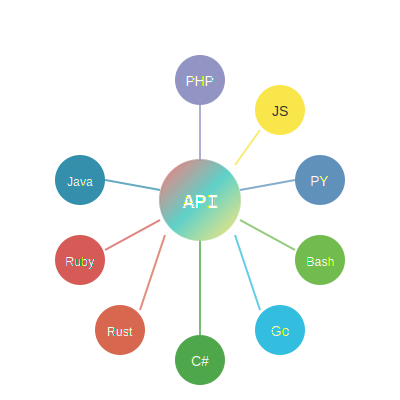

# 🐘 TuskLang Development Roadmap


> **"Configuration with a Heartbeat"** - The roadmap to making TuskLang the universal configuration standard

## 📅 Overview

This roadmap outlines the next 50 critical features and improvements for TuskLang, focusing on completing the ecosystem, enhancing enterprise capabilities, and ensuring production readiness across all supported languages.

**Last Updated:** July 13 2025  
**Version:** 2.0 Roadmap

---

## 🥜 Phase 1: Universal .pnt Support (Q1 2025)

### Missing .pnt Support (1-9)

The peanut (.pnt) binary compilation system currently exists only in PHP. This phase brings the same performance benefits to all SDKs.

- [ ] **1. JavaScript SDK** - Add .pnt binary compilation
  - Implement `PeanutConfig` class with Node.js binary support
  - Target: 85% performance improvement over text parsing
  - Binary format: MessagePack or custom binary protocol

- [ ] **2. Python SDK** - Add .pnt binary compilation  
  - Create `peanut_config.py` with pickle/msgpack support
  - Hierarchical directory walking with pathlib
  - Match PHP's 85% performance gain

- [ ] **3. Go SDK** - Add .pnt binary compilation
  - Implement `peanut` package with encoding/gob
  - Concurrent compilation support
  - Zero-allocation parsing for maximum performance

- [ ] **4. Rust SDK** - Add .pnt binary compilation
  - Zero-copy binary format with serde
  - WASM compilation support
  - Fastest implementation target

- [ ] **5. Java SDK** - Add .pnt binary compilation
  - `PeanutConfig` class with custom serialization
  - JIT compilation benefits
  - Spring Boot integration

- [ ] **6. C# SDK** - Add .pnt binary compilation
  - .NET binary serialization
  - AOT compilation support
  - MSBuild task integration

- [ ] **7. Ruby SDK** - Add .pnt binary compilation
  - Marshal format for binary storage
  - Rails asset pipeline integration
  - MRI and JRuby support

- [ ] **8. Bash SDK** - Add .pnt binary compilation
  - Binary format reader in pure bash
  - Fallback to text mode
  - POSIX compliance

- [ ] **9. Cross-Language .pntb Specification**
  - Unified binary format specification
  - Version compatibility matrix
  - Migration tools between formats

---

## 📦 Phase 2: Package Registry & Distribution (Q1-Q2 2025)

### Package Management Infrastructure (10-20)

Establish TuskLang as a first-class citizen in all major package ecosystems.

- [ ] **10. Package Registry** - Build tusklang.org/packages
  - Central registry for TuskLang packages
  - Version management and dependency resolution
  - CDN distribution with global edge nodes

- [ ] **11. npm** - JavaScript SDK publication
  - Official @tusklang/core package
  - TypeScript definitions included
  - Weekly release cycle

- [ ] **12. PyPI** - Python SDK publication
  - tusklang package with wheels
  - Python 3.8+ support
  - Type hints included

- [ ] **13. pkg.go.dev** - Go SDK listing
  - github.com/tusklang/go module
  - Comprehensive godoc
  - Example code included

- [ ] **14. crates.io** - Rust SDK publication
  - tusklang crate
  - no_std support
  - WASM target included

- [ ] **15. Maven Central** - Java SDK release
  - org.tusklang:tusklang artifact
  - Gradle and Maven support
  - Android compatibility

- [ ] **16. NuGet** - C# SDK publication
  - TuskLang package
  - .NET Standard 2.0+
  - Source Link support

- [ ] **17. RubyGems** - Ruby SDK release
  - tusklang gem
  - Ruby 2.7+ support
  - Rails generator included

- [ ] **18. Package Signing** - Security infrastructure
  - GPG signing for all packages
  - Reproducible builds
  - Supply chain security

- [ ] **19. Analytics** - Download tracking
  - Anonymous usage statistics
  - Popular package identification
  - Trend analysis

- [ ] **20. Security Scanning** - Package validation
  - Automated vulnerability scanning
  - License compliance checking
  - Dependency audit reports

---

## 🚀 Phase 3: Advanced @ Operators (Q2 2025)

### Missing @ Operators Across SDKs (21-30)

Extend TuskLang's @ operator system with modern integration patterns.

- [ ] **21. @graphql** - GraphQL query support
  ```tsk
  users: @graphql("{ users { id name email } }")
  ```

- [ ] **22. @grpc** - gRPC service calls
  ```tsk
  service_response: @grpc("UserService.GetUser", {"id": 123})
  ```

- [ ] **23. @websocket** - WebSocket connections
  ```tsk
  live_data: @websocket("wss://api.example.com/stream")
  ```

- [ ] **24. @sse** - Server-Sent Events
  ```tsk
  events: @sse("https://api.example.com/events")
  ```

- [ ] **25. @nats** - NATS messaging
  ```tsk
  message_queue: @nats("orders.new", "subscribe")
  ```

- [ ] **26. @amqp** - RabbitMQ support
  ```tsk
  queue_depth: @amqp("queue.stats", "orders")
  ```

- [ ] **27. @kafka** - Kafka streaming
  ```tsk
  stream_offset: @kafka("topic", "consumer-group")
  ```

- [ ] **28. @temporal** - Workflow integration
  ```tsk
  workflow_status: @temporal("OrderWorkflow", "status")
  ```

- [ ] **29. @vault** - HashiCorp Vault secrets
  ```tsk
  api_key: @vault("secret/data/api", "key")
  ```

- [ ] **30. @consul** - Service discovery
  ```tsk
  service_url: @consul("api-service", "healthy")
  ```

---

## 🏢 Phase 4: Enterprise Features (Q2-Q3 2025)

### Enterprise-Grade Capabilities (31-40)

Features required for Fortune 500 adoption.

- [ ] **31. SAML Authentication**
  - Single Sign-On support
  - Multiple IdP compatibility
  - Attribute mapping

- [ ] **32. OAuth2/OIDC Integration**
  - Standard OAuth2 flows
  - PKCE support
  - Token management

- [ ] **33. Audit Logging**
  - Compliance-ready logs
  - Tamper-proof storage
  - Retention policies

- [ ] **34. FIPS 140-2 Mode**
  - Certified cryptography
  - Compliance documentation
  - Validation tools

- [ ] **35. SOC2 Features**
  - Control implementation
  - Evidence collection
  - Automated reporting

- [ ] **36. GDPR Compliance**
  - Data anonymization
  - Right to deletion
  - Consent management

- [ ] **37. Multi-tenancy**
  - Isolated configurations
  - Resource quotas
  - Tenant management

- [ ] **38. RBAC System**
  - Fine-grained permissions
  - Role hierarchies
  - Dynamic policies

- [ ] **39. Enterprise Licensing**
  - Seat management
  - Usage tracking
  - License compliance

- [ ] **40. SLA Monitoring**
  - Uptime tracking
  - Performance metrics
  - Automated alerts

---

## 🛠️ Phase 5: Production Infrastructure (Q3-Q4 2025)

### Cloud-Native & Observability (41-50)

Production-ready infrastructure and monitoring.

- [ ] **41. Kubernetes Operator**
  - ConfigMap management
  - Secret rotation
  - CRD support

- [ ] **42. Helm Charts**
  - Production-ready charts
  - Value templating
  - Multi-environment support

- [ ] **43. Terraform Provider**
  - Resource management
  - State tracking
  - Import support

- [ ] **44. CloudFormation**
  - AWS native templates
  - Custom resources
  - Stack management

- [ ] **45. Azure ARM Templates**
  - Azure Resource Manager
  - Bicep support
  - Policy compliance

- [ ] **46. Google Deployment Manager**
  - GCP native configs
  - Type providers
  - Composite types

- [ ] **47. Datadog Integration**
  - Custom metrics
  - APM tracing
  - Log correlation

- [ ] **48. New Relic Integration**
  - Performance monitoring
  - Error tracking
  - Custom dashboards

- [ ] **49. PagerDuty Alerts**
  - Incident management
  - Escalation policies
  - On-call scheduling

- [ ] **50. Grafana Dashboards**
  - Metric visualization
  - Alert rules
  - Template variables

---

## 📊 Success Metrics

### Phase 1 Success (Q1 2025)
- All 9 languages support .pnt binary compilation
- 85% performance improvement achieved
- Cross-language compatibility verified

### Phase 2 Success (Q2 2025)
- Published to all major package managers
- 10,000+ downloads in first month
- Security scanning operational

### Phase 3 Success (Q2 2025)
- All @ operators implemented
- Integration tests passing
- Documentation complete

### Phase 4 Success (Q3 2025)
- Enterprise pilot programs
- SOC2 Type 1 achieved
- 5 Fortune 500 evaluations

### Phase 5 Success (Q4 2025)
- Production deployments
- 99.9% uptime achieved
- Full observability stack

---

## 🤝 Contributing

We welcome contributions! Priority areas:
1. .pnt implementation for your favorite language
2. @ operator plugins
3. Integration examples
4. Performance optimizations

See [CONTRIBUTING.md](CONTRIBUTING.md) for guidelines.


---



